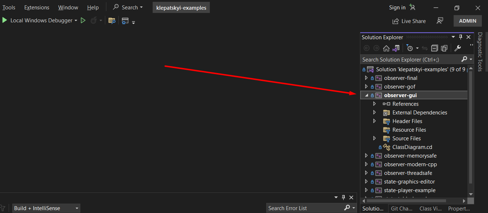
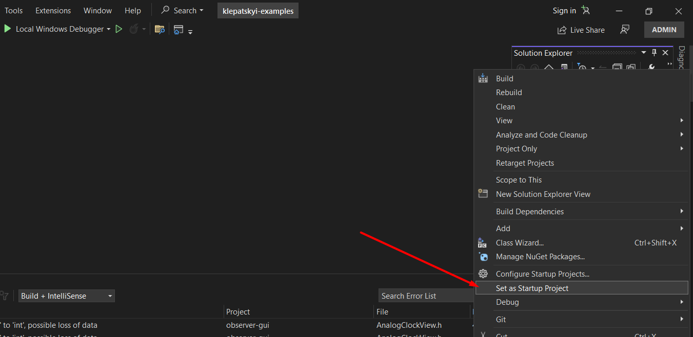

# Observer State
Приклади до доповіді на курс ВППІ

# Установка
Приклади поширюються як проекти у одному solution MS Visual Studio.  
Все працює у версії MS Visual Studio 2022.  
Якщо у вас виникають якісь проблеми з лінкуванням або вам потрібна версія з CMake, напишіть мені в особисті.

## Запуск прикладів
Приклади розташовані в окремих проектах, для їх запуску треба спочатку виділити обраний проект як стартовий. (див. скріншоти нижче)

